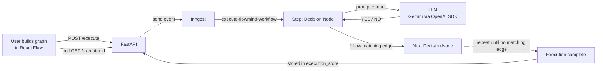
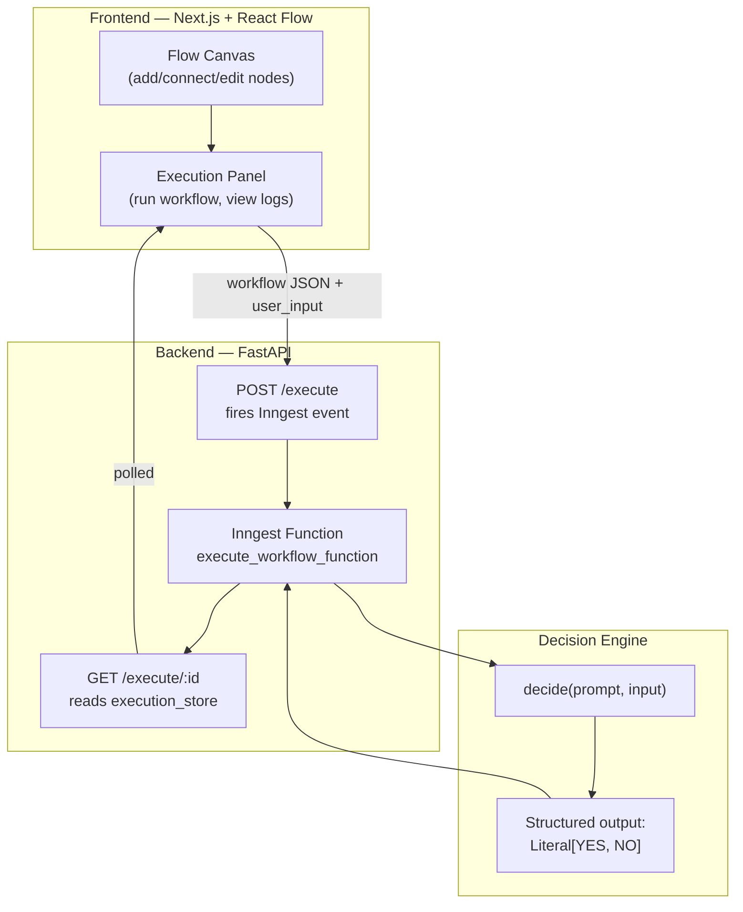
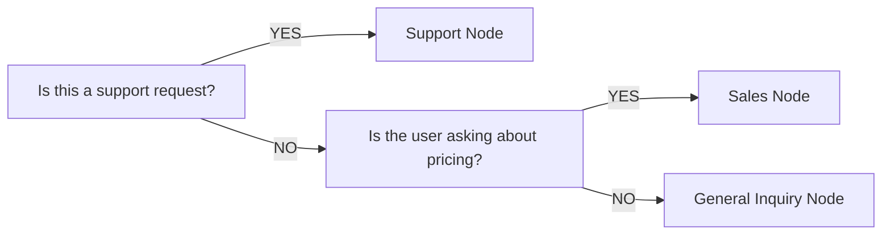

# 🧠 FlowMind

**Visual AI Workflow Builder** — design decision trees on a canvas, where every node is an AI agent that answers a yes/no question, and every path it takes is executed durably through Inngest.

<p align="left">
  
  
  
  
  
</p>

---

## 📚 Table of Contents

- [What is FlowMind?](#-what-is-flowmind)
- [How it works](#-how-it-works)
- [Architecture](#-architecture)
- [Tech Stack](#-tech-stack)
- [Project Structure](#-project-structure)
- [Getting Started](#-getting-started)
- [Environment Variables](#-environment-variables)
- [Running the App](#-running-the-app)
- [API Reference](#-api-reference)
- [Example Workflow](#-example-workflow)

---

## 🔍 What is FlowMind?

FlowMind lets you build **AI decision workflows** visually, like a flowchart, where each node asks a yes/no question and branches accordingly.

> *"Is this a support request?"*
> - **YES** → route to the Support node
> - **NO** → route to the Sales node

You drag out nodes, write a prompt for each one, wire up `YES`/`NO` edges, then run a piece of test input through the graph. Each node calls an LLM, gets back a strict `YES` or `NO`, and the graph follows the matching edge — live, with the active path highlighted on the canvas.

<details>
<summary><b>Why Inngest?</b></summary>
<br>

Every node in the graph is executed as its own durable **Inngest step** (`ctx.step.run`). That means:
- Each AI call is retried independently if it fails, instead of restarting the whole workflow.
- Long or branching workflows don't block the HTTP request — they run in the background and the frontend polls for the result.
- Execution order and per-node output are captured for free, which is what powers the execution log panel in the UI.

</details>

---

## ⚙️ How it works



**Traversal logic**, step by step:

1. Start at the workflow's `start_node`.
2. Send that node's `prompt` + the user's test input to the LLM.
3. The LLM is forced (via a structured output schema) to answer with exactly `"YES"` or `"NO"`.
4. Look for an edge leaving this node whose `condition` matches the decision.
5. If found, jump to that edge's target node and repeat. If not, the workflow ends.
6. A visited-node guard prevents infinite loops.

---

## 🏗 Architecture



---

## 🧰 Tech Stack

| Layer | Technology |
|---|---|
| Frontend framework | [Next.js 16](https://nextjs.org/) (App Router) + React 19 |
| Flow canvas | [`@xyflow/react`](https://reactflow.dev/) (React Flow) |
| UI components | [shadcn](https://ui.shadcn.com/) + Tailwind CSS 4 |
| Backend framework | [FastAPI](https://fastapi.tiangolo.com/) |
| Durable execution | [Inngest](https://www.inngest.com/) (Python SDK) |
| LLM access | OpenAI SDK (`AsyncOpenAI`), pointed at Gemini's OpenAI-compatible endpoint |
| Model | `gemini-2.5-flash` |
| Validation | Pydantic v2 (structured `YES` / `NO` output schema) |
| Package management | `uv` (backend), `npm` (frontend) |

---

## 📁 Project Structure

```
flowmind/
├── backend/
│   ├── main.py              # FastAPI app + Inngest route registration
│   ├── functions.py         # Inngest function: workflow traversal + execution
│   ├── nodes.py             # Pydantic models: Node, Edge, Workflow, ExecuteRequest
│   ├── ai.py                # decide() — sends prompt to the LLM, enforces YES/NO
│   ├── config.py            # LLM client config (API key, base URL, model)
│   └── inngest_client.py    # Inngest client instance
│
├── app/
│   └── workflow.py          # Standalone (non-Inngest) traversal reference impl
│
├── frontend/
│   └── src/
│       ├── app/
│       │   ├── page.tsx     # Main canvas + toolbar + execution panel
│       │   └── layout.tsx
│       ├── components/ui/
│       │   ├── DecisionNode.tsx   # Custom React Flow node (prompt + YES/NO handles)
│       │   └── button.tsx         # shadcn button
│       └── lib/
│           ├── api.ts       # Backend fetch helper
│           └── utils.ts
│
├── pyproject.toml           # Backend deps (uv)
├── requirements.txt         # Backend deps (pip alternative)
└── main.py                  # Entry stub
```

---

## 🚀 Getting Started

### Prerequisites

- **Node.js** 18.18+ and **npm**
- **Python** 3.12+
- **uv** ([install guide](https://docs.astral.sh/uv/getting-started/installation/)) — or `pip` with `requirements.txt`
- A **Gemini API key** ([get one here](https://aistudio.google.com/apikey))

<details>
<summary><b>1. Clone & install backend deps</b></summary>

```bash
cd flowmind
uv sync
# or, without uv:
pip install -r requirements.txt
```
</details>

<details>
<summary><b>2. Install frontend deps</b></summary>

```bash
cd frontend
npm install
```
</details>

<details>
<summary><b>3. Install the Inngest CLI (for local dev server)</b></summary>

No install needed — run it directly with `npx` (see [Running the App](#-running-the-app)).
</details>

---

## 🔑 Environment Variables

Create a `.env` file inside `backend/` (or the project root, wherever `config.py` is run from):

```env
GEMINI_API_KEY=your_gemini_api_key_here
```

| Variable | Required | Description |
|---|---|---|
| `GEMINI_API_KEY` | ✅ | API key for Gemini, used through the OpenAI-compatible endpoint |

---

## ▶️ Running the App

You'll need **three terminals** running at once:

<details open>
<summary><b>Terminal 1 — Backend (FastAPI)</b></summary>

```bash
cd flowmind
uv run uvicorn backend.main:app --reload --port 8000
```
API available at `http://localhost:8000`
</details>

<details open>
<summary><b>Terminal 2 — Inngest Dev Server</b></summary>

```bash
npx inngest-cli@latest dev
```
Dashboard available at `http://localhost:8288` — this is where you can watch each node execute step-by-step, inspect retries, and see run history.
</details>

<details open>
<summary><b>Terminal 3 — Frontend (Next.js)</b></summary>

```bash
cd frontend
npm run dev
```
App available at `http://localhost:3000`
</details>

Once all three are running: open `http://localhost:3000`, build your graph, type a test input, and hit **Run Workflow**.

---

## 🔌 API Reference

| Method | Endpoint | Description |
|---|---|---|
| `GET` | `/` | Health check |
| `POST` | `/execute` | Submits a workflow + test input, fires the `flowmind/workflow.execute` Inngest event, returns an `event_id` |
| `GET` | `/execute/{event_id}` | Polls for the result of a submitted execution |

<details>
<summary><b>POST /execute — request body</b></summary>

```json
{
  "workflow": {
    "nodes": [
      { "id": "1", "prompt": "Is this a support request?" },
      { "id": "2", "prompt": "Is the user asking about pricing?" }
    ],
    "edges": [
      { "source": "1", "target": "2", "condition": "NO" }
    ],
    "start_node": "1"
  },
  "user_input": "What is the price of your premium plan?"
}
```
</details>

<details>
<summary><b>GET /execute/{event_id} — response</b></summary>

```json
{
  "success": true,
  "completed": true,
  "execution": [
    { "node_id": "1", "prompt": "Is this a support request?", "decision": "NO" },
    { "node_id": "2", "prompt": "Is the user asking about pricing?", "decision": "YES" }
  ]
}
```
</details>

---

## 🧪 Example Workflow



Test input: `"What is the price of your premium plan?"`
Result: `1 → NO → 2 → YES → D (Sales Node)`

---