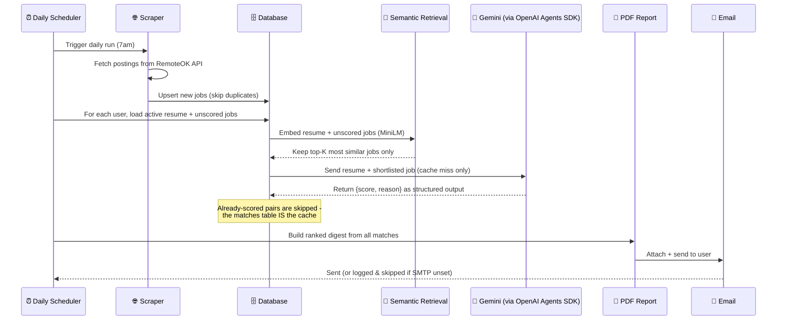
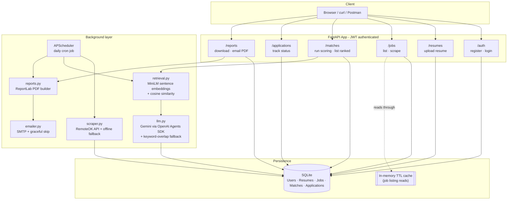

<div align="center">

# 🎯 JobRadar

### AI-powered job match & application tracker

Scrapes fresh postings, ranks them by semantic fit, scores the top candidates with an LLM,
and emails you a ranked PDF digest — every day, automatically.

*Built as a capstone project for a Backend AI Engineering internship.*

<br/>


</div>

---

## 📖 Table of contents

- [The problem](#-the-problem)
- [The solution](#-the-solution)
- [How it works — the daily flow](#-how-it-works--the-daily-flow)
- [Architecture](#-architecture)
- [The 9 concepts implemented](#-the-9-concepts-implemented)
- [Quickstart](#-quickstart)
- [Try it in 90 seconds — full demo walkthrough](#-try-it-in-90-seconds--full-demo-walkthrough)
- [API reference](#-api-reference)
- [Environment variables](#-environment-variables)
- [Project structure](#-project-structure)
- [Testing](#-testing)
- [Tech stack](#-tech-stack)
- [Design decisions & trade-offs](#-design-decisions--trade-offs)
- [Roadmap](#-roadmap)
- [FAQ](#-faq)

---

## 🧩 The problem

Job hunting is repetitive, low-signal work:

- You check 5+ job boards a day, manually, hoping something new showed up.
- Every posting takes a couple of minutes to read before you even know if it's worth applying to.
- Spreadsheet trackers record *what* you applied to, but nothing tells you *why* a role is or isn't a fit before you spend the time.

There's no free tool that closes this loop automatically: **ingest → rank by fit → tell you why → track the outcome.**

## 💡 The solution

JobRadar closes that loop as a backend service:

1. **Scrapes** fresh remote job postings on a schedule.
2. **Ranks** every unscored posting against your resume with sentence-embedding similarity, so only the most relevant jobs are considered.
3. **Scores** the top candidates with an LLM — a 0–100 fit score plus a one-sentence reason.
4. **Reports** your top matches as a PDF, delivered by email every morning.
5. Lets you **track applications** (saved → applied → interviewing → offer/rejected) through a REST API.

No manual checking. No re-reading postings you're not qualified for. You wake up to a ranked shortlist.

---

## 🔄 How it works — the daily flow



The exact same steps are also exposed as on-demand API endpoints (`POST /jobs/scrape`, `POST /matches/run`, `GET /reports/me`), so you can trigger the whole cycle manually instead of waiting for 7am — useful for demos, and for re-scoring right after you update your resume.

---

## 🏗 Architecture



---

## ✅ The 9 concepts implemented

| # | Concept | Where | Notes |
|:-:|---|---|---|
| 1 | **API endpoints** | `app/routers/` | 6 routers, full REST API, auto-documented at `/docs` |
| 2 | **Database** | `app/models.py` | SQLite + SQLAlchemy ORM — `User`, `Resume`, `Job`, `Match`, `Application` |
| 3 | **Authentication** | `app/auth.py` | JWT bearer tokens, PBKDF2 password hashing (stdlib only, no native build deps) |
| 4 | **Background / cron jobs** | `app/scheduler.py` | APScheduler daily job: scrape → retrieve → score → report → email |
| 5 | **Reporting (PDF + email)** | `app/reports.py`, `app/emailer.py` | ReportLab-generated digest, delivered via SMTP |
| 6 | **Caching** | `app/cache.py`, `app/pipeline.py` | In-memory TTL cache on job listings **+** the `matches` table doubles as a permanent score cache — a resume/job pair is never re-sent to the LLM |
| 7 | **LLM integration** | `app/llm.py` | Gemini, called via the **OpenAI Agents SDK** (`Agent` / `Runner` / `OpenAIChatCompletionsModel`) against Gemini's OpenAI-compatible endpoint, with structured (`Pydantic`) output |
| 8 | **Web scraping** *(bonus swap-in)* | `app/scraper.py` | Pulls live postings from RemoteOK's public API |
| 9 | **Semantic retrieval** *(bonus swap-in)* | `app/retrieval.py` | Embeds resume + jobs with `sentence-transformers` (MiniLM) and ranks by cosine similarity, so only the top-K most relevant postings are ever sent to the LLM |

> 🛡️ Every network-dependent piece (scraper, LLM, email) has a **graceful offline fallback** — the whole pipeline runs end-to-end with **zero API keys configured**. This was a deliberate design choice, not an afterthought: see [Design decisions](#-design-decisions--trade-offs).

---

## 🚀 Quickstart

<details open>
<summary><b>1. Clone & install</b></summary>

```bash
git clone https://github.com/mr-shaheer/flyrank-projects.git
cd jobradar
pip install -r requirements.txt
```
</details>

<details>
<summary><b>2. Configure environment (optional)</b></summary>

```bash
cp .env.example .env
```

Every value has a safe default or fallback — you can run the whole app with an **empty `.env`**. Fill these in only when you want the real thing instead of the offline fallback:

| Want this for real? | Set this |
|---|---|
| Live LLM scoring instead of keyword-overlap | `GEMINI_API_KEY` — free at [aistudio.google.com/apikey](https://aistudio.google.com/apikey) |
| Real emails instead of a log line | `SMTP_HOST`, `SMTP_USER`, `SMTP_PASSWORD` — a Gmail [app password](https://myaccount.google.com/apppasswords) works |
</details>

<details>
<summary><b>3. Run the server</b></summary>

```bash
uvicorn app.main:app --reload
```

Open **http://127.0.0.1:8000/docs** — full interactive Swagger UI, no extra setup.
</details>

<details>
<summary><b>4. Run the smoke test</b></summary>

```bash
python test_smoke.py
```

Exercises the entire flow — register → resume → scrape → score → PDF → email → application tracking — against an isolated SQLite file, using the offline fallbacks. No API keys or internet required. Should print `ALL CHECKS PASSED ✅`.
</details>

---

## ⏱ Try it in 90 seconds — full demo walkthrough

```bash
# 1. Register
curl -s -X POST http://127.0.0.1:8000/auth/register \
  -H "Content-Type: application/json" \
  -d '{"email":"you@example.com","password":"hunter2"}'

# 2. Log in → grab the token
TOKEN=$(curl -s -X POST http://127.0.0.1:8000/auth/login \
  -d "username=you@example.com&password=hunter2" \
  | python3 -c "import sys,json; print(json.load(sys.stdin)['access_token'])")

# 3. Upload your resume
curl -s -X POST http://127.0.0.1:8000/resumes \
  -H "Authorization: Bearer $TOKEN" -H "Content-Type: application/json" \
  -d '{"content_text":"Backend engineer skilled in Python, FastAPI, Postgres, and LLM integrations."}'

# 4. Pull fresh postings
curl -s -X POST http://127.0.0.1:8000/jobs/scrape -H "Authorization: Bearer $TOKEN"

# 5. Score them against your resume
curl -s -X POST http://127.0.0.1:8000/matches/run -H "Authorization: Bearer $TOKEN"

# 6. See your ranked matches
curl -s http://127.0.0.1:8000/matches/me -H "Authorization: Bearer $TOKEN" | python3 -m json.tool

# 7. Download your PDF digest
curl -s http://127.0.0.1:8000/reports/me -H "Authorization: Bearer $TOKEN" -o digest.pdf
```

That's the entire product, end to end, in seven calls.

---

## 📡 API reference

<details>
<summary><b>🔑 Auth</b></summary>

| Method | Path | Body | Description |
|---|---|---|---|
| `POST` | `/auth/register` | `{email, password}` | Create an account |
| `POST` | `/auth/login` | form: `username, password` | Get a JWT bearer token |

</details>

<details>
<summary><b>📄 Resumes</b></summary>

| Method | Path | Body | Description |
|---|---|---|---|
| `POST` | `/resumes` | `{content_text}` | Upload/replace your active resume |
| `GET` | `/resumes/me` | — | View your current resume |

</details>

<details>
<summary><b>💼 Jobs</b></summary>

| Method | Path | Query | Description |
|---|---|---|---|
| `GET` | `/jobs` | `limit` (default 50) | List postings — cached (5 min TTL) |
| `POST` | `/jobs/scrape` | — | Manually pull fresh postings now |

</details>

<details>
<summary><b>🎯 Matches</b></summary>

| Method | Path | Description |
|---|---|---|
| `POST` | `/matches/run` | Shortlist unscored jobs by semantic similarity, then score the top candidates against your active resume |
| `GET` | `/matches/me` | List your matches, ranked by score, highest first |

</details>

<details>
<summary><b>📋 Applications</b></summary>

| Method | Path | Body | Description |
|---|---|---|---|
| `POST` | `/applications` | `{job_id, status, notes}` | Start tracking a job |
| `GET` | `/applications/me` | — | List everything you're tracking |
| `PATCH` | `/applications/{id}` | `{status?, notes?}` | Update status (`saved`→`applied`→`interviewing`→`offer`/`rejected`) |

</details>

<details>
<summary><b>📊 Reports</b></summary>

| Method | Path | Description |
|---|---|---|
| `GET` | `/reports/me` | Generate + download your PDF digest right now |
| `POST` | `/reports/email-me` | Generate + email your PDF digest right now |

</details>

All endpoints except `/auth/*` require `Authorization: Bearer <token>`. Full interactive docs (with "Try it out" buttons) live at `/docs` once the server is running.

---

## ⚙️ Environment variables

| Variable | Default | Purpose |
|---|---|---|
| `DATABASE_URL` | `sqlite:///./jobradar.db` | DB connection string — swap for Postgres in production |
| `SECRET_KEY` | *dev placeholder* | JWT signing key — **set a real random value in production** |
| `ACCESS_TOKEN_EXPIRE_MINUTES` | `1440` | JWT lifetime |
| `GEMINI_API_KEY` | *unset → offline fallback* | Enables real LLM scoring via Gemini |
| `GEMINI_BASE_URL` | Gemini's OpenAI-compatible endpoint | Change only if Google updates the URL |
| `LLM_MODEL` | `gemini-2.5-flash` | Any Gemini chat model |
| `SMTP_HOST` / `SMTP_USER` / `SMTP_PASSWORD` | *unset → email skipped, logged instead* | Real email delivery |
| `SCRAPE_LIMIT` | `40` | Max postings pulled per scrape |
| `DAILY_RUN_HOUR` | `7` | Hour (0–23, server time) the cron cycle fires |
| `JOB_LIST_CACHE_TTL_SECONDS` | `300` | How long `/jobs` responses are cached |
| `REPORTS_DIR` | `./reports` | Where generated PDFs are written |

See `.env.example` for the full, commented template.

---

## 🗂 Project structure

```
jobradar/
├── app/
│   ├── main.py              # FastAPI app, router wiring, lifespan (DB init + scheduler)
│   ├── config.py            # Settings, all from env vars with safe defaults
│   ├── database.py          # SQLAlchemy engine/session
│   ├── models.py            # ORM models: User, Resume, Job, Match, Application
│   ├── schemas.py           # Pydantic request/response schemas
│   ├── auth.py              # JWT + PBKDF2 password hashing
│   ├── cache.py             # In-memory TTL cache
│   ├── scraper.py           # RemoteOK scraping + offline fallback
│   ├── retrieval.py         # Semantic retrieval — MiniLM embeddings + cosine similarity
│   ├── llm.py                # Gemini scoring via OpenAI Agents SDK + offline fallback
│   ├── pipeline.py           # Scoring orchestration (retrieval-aware, cache-aware)
│   ├── reports.py            # PDF digest generation (ReportLab)
│   ├── emailer.py            # SMTP delivery + graceful skip
│   ├── scheduler.py          # APScheduler daily cron job
│   └── routers/               # auth, resumes, jobs, matches, applications, reports
├── requirements.txt
├── .env.example
├── test_smoke.py             # End-to-end test, no API keys required
└── README.md
```

---

## 🧪 Testing

```bash
python test_smoke.py
```

Runs the **entire product flow** in one script — register, login, upload resume, scrape, score, list matches, generate a PDF, attempt an email, and track an application through a full status change — all against an isolated SQLite file. Uses the offline fallbacks by default, so it passes with zero configuration; set `GEMINI_API_KEY` before running it to also exercise the real Gemini call path.

---

## 🛠 Tech stack

<div align="center">


<br/><br/>


<br/><br/>


</div>

<br/>

| Layer | Choice | Why |
|:-:|---|---|
| API framework | **FastAPI** | Async, typed, auto-generates OpenAPI docs |
| Database | **SQLite** + SQLAlchemy | Zero setup; swap `DATABASE_URL` for Postgres later with no code changes |
| Auth | **PyJWT** + stdlib PBKDF2 | No native bcrypt build headaches, no extra service |
| Scheduler | **APScheduler** | In-process cron, no external infra needed |
| PDF | **ReportLab** | Fast, dependency-light table/paragraph rendering |
| Semantic retrieval | **Sentence-Transformers** (MiniLM) + cosine similarity | Cuts LLM calls by pre-filtering to the top-K most relevant jobs before scoring |
| LLM | **Gemini**, via **OpenAI Agents SDK** | Free tier, structured (`Pydantic`) output, agent framework reused as taught in the program |
| Scraping | **Requests** → RemoteOK public API | No auth needed, stable JSON, permissive for personal use |

Everything is free-tier / open source. No credit card required.

---

## 🧭 Design decisions & trade-offs

**Why does everything have an offline fallback?**
Grading and demos shouldn't depend on a live API key working at the exact moment someone reviews the repo. Every external call — scraping, LLM scoring, email — degrades to a deterministic, testable substitute instead of throwing a 500. This is also just good production practice: a flaky third-party API shouldn't take down your whole pipeline.

**Why rank with semantic retrieval before calling the LLM?**
Embedding a resume against every unscored job and keeping only the top-K most similar (via `sentence-transformers` + cosine similarity) means the LLM is only ever asked to judge postings that are already plausible fits. It's cheaper, faster, and keeps the digest focused on genuinely relevant roles instead of scoring noise.

**Why is the `matches` table also the cache?**
LLM calls cost money and time. Once a (user, job) pair has been scored, it's never re-sent — the scheduler and the manual `/matches/run` endpoint both check "has this pair been scored?" before calling the LLM. This makes daily re-runs cheap: only genuinely new postings get scored.

**Why SQLite instead of Postgres?**
Zero setup for local dev and grading. `DATABASE_URL` is the only thing that would change to move to Postgres (Supabase/Neon free tier) — the ORM layer doesn't care.

**Why the OpenAI Agents SDK for a Gemini model?**
Gemini exposes an OpenAI-compatible endpoint, so `OpenAIChatCompletionsModel` (from the OpenAI Agents SDK) can point at it directly via `base_url`. This gets the SDK's `Agent`/`Runner` abstractions and typed `output_type` structured outputs without being locked into OpenAI's own models.

---

## 🗺 Roadmap

- [ ] Multiple resumes per user, with per-resume match history
- [ ] Slack/Discord notification channel alongside email
- [ ] Postgres (Supabase/Neon free tier) for multi-instance deploys
- [ ] Deploy API + scheduler as separate services on Render/Railway free tier
- [ ] Additional scraping sources beyond RemoteOK
- [ ] Configurable top-K for semantic retrieval, exposed as a user setting

---

## ❓ FAQ

<details>
<summary><b>Does this cost anything to run?</b></summary>

No. SQLite, RemoteOK's public API, Gemini's free tier, and Gmail SMTP with an app password are all free. No credit card required anywhere in the stack.
</details>

<details>
<summary><b>What happens if I don't set any API keys?</b></summary>

The app still runs completely. Scraping falls back to a small bundled sample dataset, scoring falls back to a deterministic keyword-overlap algorithm, and email sending is skipped with a log message — the PDF is still generated and downloadable via `/reports/me`.
</details>

<details>
<summary><b>Can I use a different LLM provider?</b></summary>

Yes — swap the `AsyncOpenAI(base_url=...)` in `app/llm.py` for any other OpenAI-compatible endpoint (OpenAI itself, Groq, local Ollama with an OpenAI-compat shim, etc.) and update `LLM_MODEL`. The `Agent`/`Runner`/`output_type` code doesn't need to change.
</details>

<details>
<summary><b>How do I add more job sources?</b></summary>

Add a new fetch function in `app/scraper.py` following the same shape as `_fetch_raw_jobs`, and merge its results before the upsert loop in `scrape_and_store_jobs`. The `external_id` uniqueness constraint on `Job` already prevents duplicates across sources.
</details>

<details>
<summary><b>Why doesn't the LLM score every job?</b></summary>

`app/retrieval.py` embeds the resume and all unscored jobs, then keeps only the top-K most semantically similar postings (default 10) before they're sent to the LLM in `app/pipeline.py`. This keeps scoring fast and cheap without sacrificing match quality — a job with near-zero semantic overlap with your resume was never going to score well anyway.
</details>

<div align="center">

<br/>

Built with Python and FastAPI — a backend AI engineering capstone.

</div>